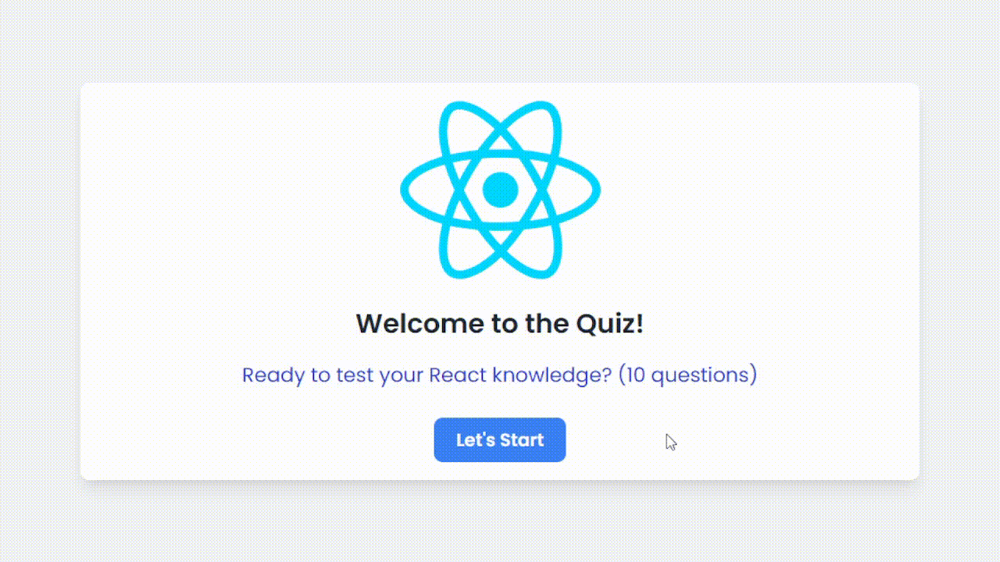
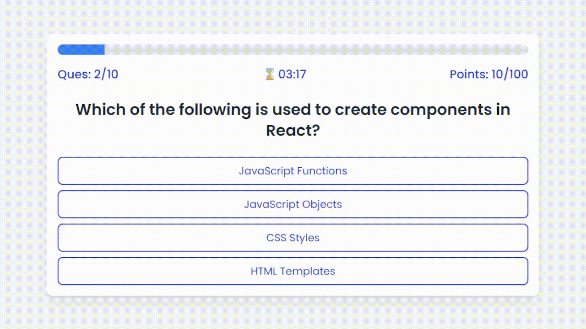
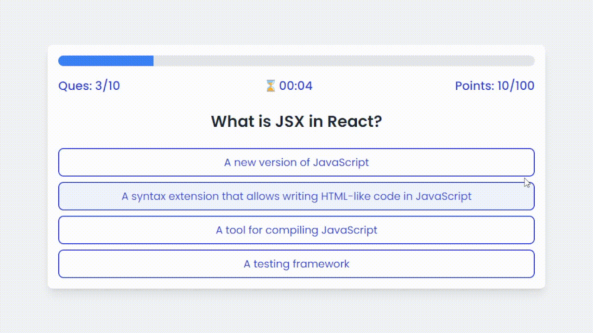
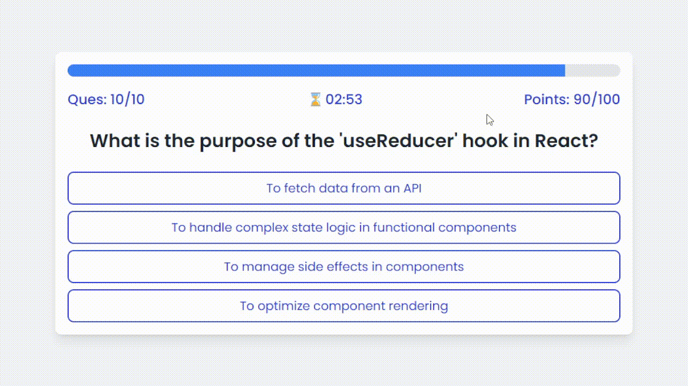

# React Quiz App

A simple and interactive React-based quiz application designed to test your knowledge of React concepts. This app is built with a modern tech stack and features real-time quizzes with a timer, scoring, and a clean UI for a better user experience.

## Features

- **Dynamic Quiz Questions**: Load questions from a JSON file, providing a flexible way to manage quiz data.
- **State Management**: Uses React’s Context API and Reducer for global state management.
- **Timer**: Each question comes with a countdown timer to add excitement and challenge.
- **Scoring**: Track your score as you answer questions correctly.
- **Responsive Design**: Mobile-friendly layout with custom breakpoints using TailwindCSS.
- **React Hooks**: Utilizes various React hooks like `useState`, `useEffect`, `useReducer`, and `useContext` for a modern React development experience.
- **Local Development**: Uses Vite for a fast development environment and JSON Server to serve quiz data.

## Tech Stack

- **React**: A JavaScript library for building user interfaces.
- **Vite**: Next-generation, fast build tool for modern web development.
- **TailwindCSS**: Utility-first CSS framework for rapidly building custom designs.
- **JSON Server**: Full fake REST API for serving quiz questions.
- **React Context & Reducer**: Used for global state management.

## Setup & Installation

Follow these steps to get the project up and running on your local machine:

### 1. Clone the repository

Clone the repository to your local machine:
### `git clone https://github.com/yourusername/react-quiz-app.git`
### `cd react-quiz-app`

### 2. Install dependencies

Install the required dependencies:
### `npm install`

### 3. Start JSON Server

The app uses a mock API to serve quiz data. To run the server, use the following command:
### `npm run server`

### 4. Start the development server

To run the app locally, start the development server:
### `npm run dev`

### 5. Build the app for production

To prepare the app for production, use the following command:
### `npm run build`

### 6. Preview the build

You can preview the production build locally with:
### `npm run preview`

## Usage

Once the app is running, you'll be able to:

- **Start the quiz** and answer questions.
- **See a progress bar** showing your current question and score.
- **Track time remaining** for each question.

## Demo Walkthrough

### 1. Quiz Start and Answer Selection

### 2. Wrong Answer Flow

### 3. Time Expiration Scenario

### 4. Quiz Results

